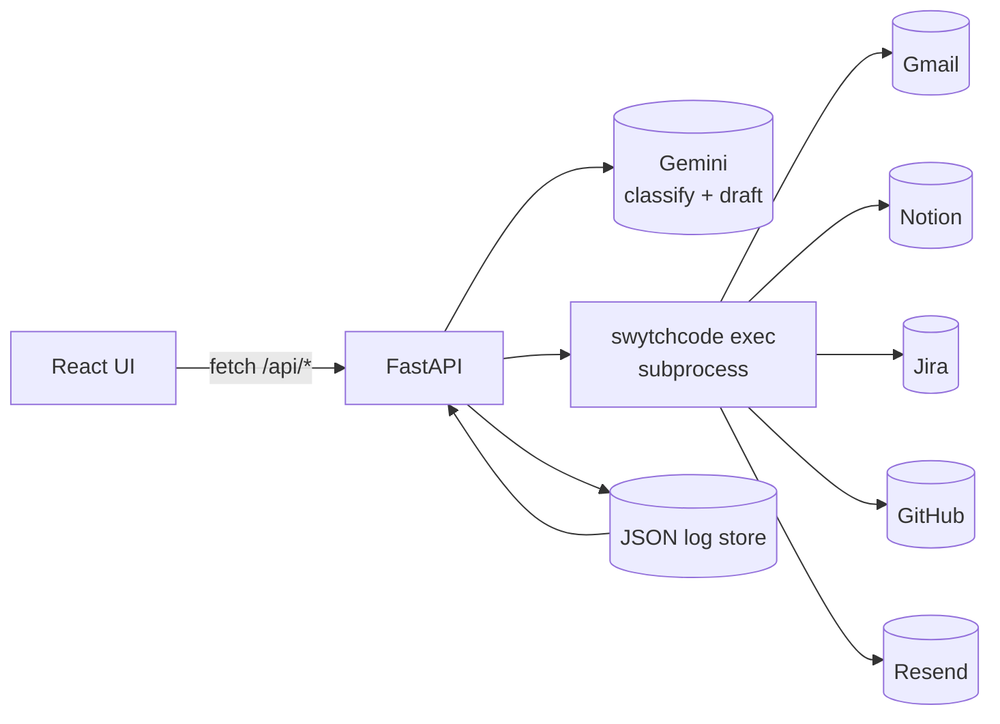
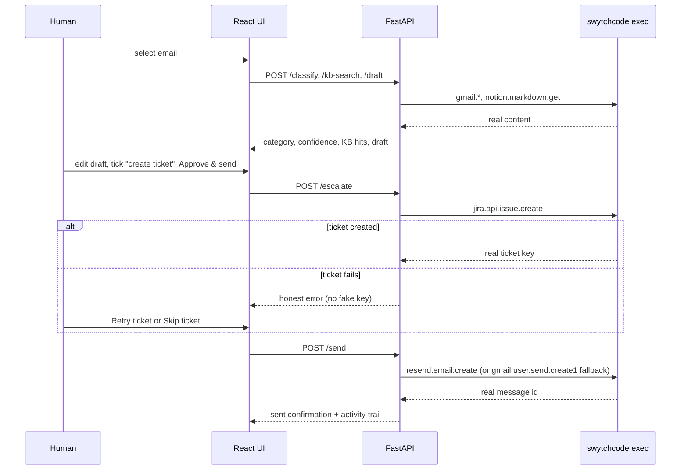
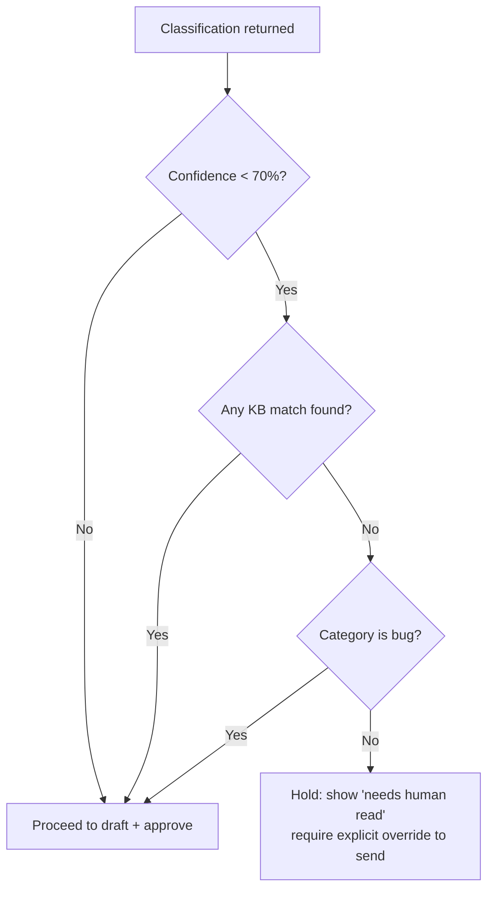

# 🎧 Support Agent — Inbox to Resolution, One Approval

<p align="left">
  
  
  
  
  
  
</p>

> **Support Agent** turns one real customer email into a grounded reply, a real Jira ticket, and a sent update — with a single human approval, not five open tabs. Every claim in the drafted reply traces to a real, seeded Notion page; if nothing matches, it says so instead of guessing.

Built **Swytchcode-first, not chatbot-first**: the LLM only ever produces classification and draft *text* — every actual call to Gmail, Notion, Jira, GitHub, or Resend goes through `swytchcode exec`, never a direct provider SDK.

Track 1 build for **Build with Swytchcode** (KNOTiC).

---

## ✨ Features

**Grounded triage, not guessing**
- Classifies every email into `bug` / `billing` / `how_to` / `other` with a confidence score and a one-line, evidence-based reason ("matched error code AUTH-403"), not a bare percentage.
- A **confidence + KB-match hold**: if confidence is low *and* nothing matched in the knowledge base, the agent visibly stops and asks a human to review instead of sending a guess.
- Draft replies cite only Notion pages that were actually retrieved for that email — no citation, no ticket ID, no send confirmation is ever fabricated.

**Real integrations, real failures shown honestly**
- Gmail: list, read, and send through the real Gmail API (`swytchcode exec gmail.*`).
- Notion: knowledge base fetched from real seeded pages via `notion.markdown.get`, matched locally (see *Honesty by design* — Notion's own search endpoint is broken registry-side).
- Jira: real issue creation via `jira.api.issue.create` — when it fails, the UI shows the real reason and offers **Retry ticket** / **Skip ticket**, never a made-up ticket key.
- GitHub: real duplicate-issue search (`github.issue.list.1`, the Search API, not the "assigned to me" list) as a stretch feature.
- Resend → Gmail fallback: sends go through Resend if a verified sender is configured, otherwise fall back to Gmail automatically and say so.

**A guided console, not a developer dashboard**
- A persistent 4-step strip (Pick email → AI drafts → You approve → Send) always visible, never hidden behind a wizard.
- One state-driven **Next step** card with exactly one primary action at a time.
- A plain-language **"What AI can do"** checklist and **activity trail** — no raw tool names, no log timestamps as the primary UI.

---

## 🧱 Tech Stack

| Layer | Choice |
| --- | --- |
| Backend framework | FastAPI (Python 3.12) |
| Tool execution | Swytchcode CLI (`swytchcode exec <canonical_id>`) via subprocess — the only path to any provider API |
| LLM | Google Gemini (`gemini-flash-latest`) for classify + draft; Anthropic supported as an alternate |
| Integrations | Gmail, Notion, Jira, GitHub, Resend — all via Swytchcode |
| Log store | Flat JSON file (`backend/data/state.json`) — the activity trail's source of truth |
| Frontend | React 19 + TypeScript (strict) + Vite |
| Styling | Plain CSS, light support-ops visual direction (no framework) |

---

## 🏛️ Architecture

### High-level request flow



- The UI never holds a provider credential — it only calls the FastAPI backend.
- The LLM never calls a tool directly — it returns text, and the backend decides whether/when to call `swytchcode exec`.
- Swytchcode resolves its own provider auth (`swytchcode auth connect`) — the app never sees a raw Gmail/Jira/Notion token.

### Approve-and-resolve sequence



### Human-review hold



### Project structure

```text
swytchcode-buildathon/
├── backend/
│   ├── app/
│   │   ├── main.py          # FastAPI routes: inbox, classify, kb-search, draft, escalate, send, timeline, status
│   │   ├── swytchcode.py    # exec_tool() — the only place that shells out to `swytchcode exec`
│   │   ├── gmail.py         # list/get/send, header + body parsing, date extraction
│   │   ├── notion_kb.py     # fetch seeded pages via markdown.get, local keyword matching
│   │   ├── jira.py          # issue.create, ADF description building
│   │   ├── github.py        # duplicate-issue search
│   │   ├── send.py          # Resend → Gmail fallback
│   │   ├── llm.py           # Gemini classify + draft, structured JSON output
│   │   ├── store.py         # flat-file event log + ticket idempotency
│   │   └── config.py        # env-driven settings
│   └── requirements.txt
├── frontend/
│   └── src/
│       ├── App.tsx               # state machine + orchestration
│       ├── api.ts                # typed backend client
│       ├── errors.ts             # raw error → plain-language, provider-labeled copy
│       └── components/
│           ├── TopBar.tsx        # brand + live connection pills
│           ├── EmailQueue.tsx    # search, refresh, email cards
│           └── CaseView.tsx      # next-step card, AI checklist, draft, resolve, activity
├── scripts/
│   └── set-jira-site.sh     # patches Swytchcode's placeholder Jira host to your real site
└── render.yaml               # backend deploy blueprint
```

---

## 🚀 Getting Started

### Prerequisites
- Python 3.12+, Node 20+
- The [Swytchcode CLI](https://docs.swytchcode.com), logged in (`swytchcode login`)
- A Google Gemini API key — free at [aistudio.google.com/apikey](https://aistudio.google.com/apikey)

### Install & run

```bash
# 1. Connect the providers this app uses (interactive — opens a browser each time)
swytchcode auth connect gmail
swytchcode auth connect notion
swytchcode auth connect jira
swytchcode auth connect github
swytchcode auth connect resend   # optional — falls back to Gmail if skipped

# 2. Env
cp .env.example .env   # fill in GEMINI_API_KEY, JIRA_PROJECT_KEY, NOTION_KB_PAGE_IDS, SUPPORT_FROM_EMAIL

# 3. Backend
cd backend
python3.12 -m venv .venv
./.venv/bin/pip install -r requirements.txt
./.venv/bin/uvicorn app.main:app --port 8000

# 4. Frontend (separate terminal)
cd frontend
npm install
npm run dev   # http://localhost:5173, proxies /api → localhost:8000
```

### Seed the Notion KB
Create 3–5 help pages in Notion, then paste their page IDs (from each page's URL) into `NOTION_KB_PAGE_IDS` — comma-separated.

### Environment variables

| Variable | Purpose |
| --- | --- |
| `GEMINI_API_KEY` / `ANTHROPIC_API_KEY` | LLM for classify + draft (Anthropic tried first if set) |
| `GEMINI_MODEL` | Defaults to `gemini-flash-latest` |
| `JIRA_PROJECT_KEY` | Project key tickets are filed into (e.g. `SUP`) |
| `JIRA_SITE_DOMAIN` | e.g. `yourteam.atlassian.net` — builds the clickable ticket link |
| `NOTION_KB_PAGE_IDS` | Comma-separated seeded KB page IDs |
| `SUPPORT_FROM_EMAIL` | From-address for the Gmail fallback send |
| `RESEND_FROM_EMAIL` | Verified Resend sender; unset → falls back to Gmail |
| `GITHUB_REPO` | `owner/repo` for the duplicate-issue-search stretch feature |
| `CORS_ORIGINS` | Comma-separated allowed origins; include the deployed frontend URL in prod |

Provider credentials themselves are **not** env vars — `swytchcode auth connect <provider>` resolves and stores those. Frontend uses `frontend/.env.example` → `VITE_API_BASE` (unset locally; set to the deployed backend's `/api` URL in prod).

---

## 🔍 Honesty by design (tracked, not papered over)

This app's core rule: **never fabricate a ticket ID, a citation, or a send confirmation.** Real, current integration issues found while building it, disclosed rather than hidden:

1. **Notion's `search.create` / `query.create` are broken registry-side** — they fail with a STRUCT-resolution error on Swytchcode's backend for this bundle version. Worked around by seeding a fixed list of page IDs and fetching each via `notion.markdown.get`, then keyword-matching locally — still real API calls against real content, just not Notion's own search endpoint.
2. **Swytchcode's Jira bundle ships a placeholder host** (`your-domain.atlassian.net`). `scripts/set-jira-site.sh <your-site> <PROJECT_KEY>` patches it to your real site — but Atlassian's Cloud REST API doesn't accept OAuth 2.0 bearer tokens against the direct `*.atlassian.net` host at all; it requires routing through `api.atlassian.com/ex/jira/{cloudId}/...`, which this Swytchcode bundle isn't wired for. Ticket creation therefore fails predictably — shown honestly in the UI with **Retry ticket** / **Skip ticket**, never a fake key.
3. **Large Gmail messages get truncated** by the Swytchcode CLI's response layer (big HTML newsletters) — surfaced as "Couldn't open this message" rather than parsed as silently-wrong partial content.
4. **Gmail OAuth tokens expire hourly.** `swytchcode auth disconnect gmail && swytchcode auth connect gmail` refreshes it; the backend explicitly checks the response `status_code` for this now, instead of the CLI's habit of returning exit code 0 with an error body embedded in `data`.
5. **Resend** needs a verified sending domain; until configured, sends fall back to Gmail automatically — shown as "Sent via Gmail," never faked as a Resend send.

---

## 🚶 Try it

1. Start the backend and frontend (see [Getting Started](#-getting-started)).
2. Open `http://localhost:5173`, click **Refresh emails**.
3. Click a real customer email (skip the lunch invites and system notifications the queue tip warns about).
4. Watch the **Next step** card and **What AI can do** checklist fill in live as it classifies, searches Notion, and drafts a reply.
5. Edit the draft if you want, tick **Create a Jira ticket** if it's a bug, and click **Approve, create ticket & send**.
6. If Jira fails (see *Honesty by design* above), click **Retry ticket** or **Skip ticket** — the reply still sends.
7. Expand **Activity checklist** to see the real, timestamped trail of everything that ran.

---

## ❓ FAQ

| Question | Answer |
| --- | --- |
| "Does the LLM call Gmail/Jira/Notion directly?" | No. The LLM only returns classification/draft text. The FastAPI backend decides when to call `swytchcode exec` — the model never holds or sees a credential. |
| "What happens if the knowledge base has no match?" | The draft says so explicitly ("no published answer yet — a human will follow up") instead of inventing an answer. |
| "Is the Jira integration broken?" | The host-placeholder bug is fixed by `scripts/set-jira-site.sh`; a deeper OAuth-routing bug in Swytchcode's Jira bundle remains and is documented above, not hidden. |
| "Why does the KB search use `markdown.get` instead of Notion's search API?" | Notion's search/query endpoints are currently broken on Swytchcode's registry for this bundle version — disclosed in *Honesty by design*, not silently worked around. |
| "What happens if Resend isn't configured?" | Sends fall back to Gmail automatically and the UI says "Sent via Gmail" — never fakes a Resend send. |

---

## 🗺️ Roadmap

1. Async, multi-email processing instead of one-at-a-time (swap the Gmail poll for push + a per-email job queue).
2. Postgres-backed log store once cross-ticket history matters (today: flat JSON file).
3. Resolve the Jira OAuth/cloudId routing issue upstream with Swytchcode, or switch to Basic Auth (email + API token) as a documented fallback.
4. GitHub duplicate-issue search surfaced earlier in the flow (today: only shown after ticket creation).
5. Multi-language support (explicit non-goal for this MVP).

---

## 🌐 Deploy

**Frontend → Vercel**, **backend → Render** (free tier). `frontend/vercel.json` has a harmless SPA-rewrite fallback; this app has no client-side router so it's not load-bearing.

1. Push this repo to GitHub (already public, for judge/mentor review).
2. **Backend:** Render → New → Blueprint, pointing at this repo (reads `render.yaml`: root `backend`, start `uvicorn app.main:app --host 0.0.0.0 --port $PORT`, health check `/health`). Fill in the env vars flagged `sync: false`.
3. **Frontend:** Vercel → import repo, root directory `frontend`, env var `VITE_API_BASE=https://<your-render-service>.onrender.com/api`.
4. **Smoke test:** open the Vercel URL → **Refresh emails**. If a provider isn't connected on the Render host yet, its status pill shows gray and the UI explains what failed — it still loads.
5. **Demo fallback:** if venue Wi-Fi or an API is down mid-demo, fall back to a pre-recorded clip of one full successful local run rather than fighting it live.

> Swytchcode's OAuth session lives on whichever machine ran `swytchcode auth connect` (see *Honesty by design* #2 for why this matters for Jira specifically). For the live jury round, running the backend on your own laptop is the most reliable option; use the deployed frontend against that API if you can tunnel it, or submit this repo plus a demo video of the local happy path.

### Deployability checklist

- [x] Fresh clone + env vars → runs locally
- [x] Frontend build uses `VITE_API_BASE`, no hardcoded `localhost`
- [x] Backend binds `0.0.0.0` + `$PORT` via `render.yaml`
- [x] `CORS_ORIGINS` configurable via env
- [x] Bare `/health` for Render's health check, alongside `/api/health`
- [x] Secrets only in `.env` (gitignored) / platform env vars
- [ ] Public frontend ↔ public backend, fully live — depends on completing `swytchcode auth connect` on the deployed host

---

## Non-goals

No multi-language support, no auto-send without approval, no bulk inbox processing, no SLA routing, no persistent accounts/login.
